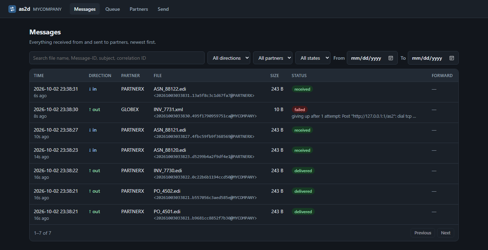
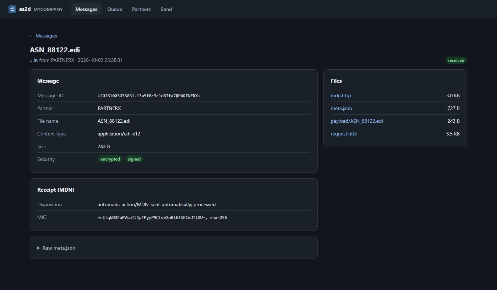

# as2d

[](https://github.com/WeadockM/as2d/actions/workflows/ci.yml)
[](https://github.com/WeadockM/as2d/releases/latest)
[](go.mod)
[](LICENSE)

A small AS2 (RFC 4130) daemon for Linux that both receives and sends.



- **Inbound:** decrypts, decompresses and verifies each message against the
  partner's certificate, archives it, drops the payload into an inbox
  folder, and returns an MDN (sync or async, signed on request). Repeated
  Message-IDs are recognized and not delivered twice.
- **Outbound:** files submitted through a local HTTP API or dropped into an
  outbox folder are compressed, signed, encrypted and sent from a persistent
  queue. Failed sends are retried with backoff, and a message is only marked
  delivered once the partner's MDN checks out (signature, disposition, MIC).
- **Integration:** received payloads can be forwarded to an HTTP endpoint
  such as a Boomi Web Services Server listener, and senders can wait for the
  partner's MDN in a single API call or receive it via a status webhook.
- **Dashboard:** a built-in web UI to search messages, inspect and retry
  failures, check partner certificates and send files.

It is a single static binary with no runtime dependencies, configured with
one JSON file. Supported: SHA-1/256/384/512 signatures and MICs,
AES-128/256 in CBC or GCM mode, zlib compression (RFC 5402), and sync and
async MDNs. Tested against itself only so far; see
[Not yet supported](#not-yet-supported).

## Build

Requires Go 1.26 or later.

```sh
go test ./...
GOOS=linux GOARCH=amd64 go build -o bin/linux-amd64/ ./cmd/...
```

From PowerShell, set the variables first: `$env:GOOS="linux"; $env:GOARCH="amd64"`.
This builds `as2d` (the daemon), `as2send` (one-off sends for testing) and
`as2keygen` (certificate generator). Prebuilt Linux and Windows binaries,
with SHA-256 checksums, are attached to each
[release](https://github.com/WeadockM/as2d/releases/latest). Alternatively:

```sh
go install github.com/WeadockM/as2d/cmd/...@latest
```

`as2d -version` prints the version. Binaries installed with `go install`
report it automatically; for builds from a checkout, stamp it like this:

```sh
go build -ldflags "-X github.com/WeadockM/as2d/internal/version.Version=v0.2.0" -o bin/ ./cmd/...
```

Changes between versions are listed in [CHANGELOG.md](CHANGELOG.md).
Releases are built by GitHub Actions; see [docs/releasing.md](docs/releasing.md).

## Install on Linux

```sh
sudo useradd --system --no-create-home --shell /usr/sbin/nologin as2d
sudo install -m 0755 bin/linux-amd64/as2d /usr/local/bin/
sudo install -d -o root -g as2d -m 0750 /etc/as2d /etc/as2d/certs /etc/as2d/partners

# Your station's certificate. Send the .crt to partners; the .key never leaves the box.
sudo bin/linux-amd64/as2keygen -id MYCOMPANY -out /etc/as2d/certs
sudo chgrp as2d /etc/as2d/certs/MYCOMPANY.key && sudo chmod 0640 /etc/as2d/certs/MYCOMPANY.key

# Partner certificates go in /etc/as2d/partners/.
sudo install -m 0640 -g as2d deploy/config.example.json /etc/as2d/config.json   # then edit it
sudo install -m 0644 deploy/as2d.service /etc/systemd/system/
sudo systemctl daemon-reload && sudo systemctl enable --now as2d
journalctl -u as2d -f
```

`GET /healthz` returns `ok` for monitoring. Partners usually expect HTTPS:
set `tls_cert`/`tls_key`, or put the daemon behind nginx or Caddy and set
`public_url` to the address partners use.

## Configuration

See [deploy/config.example.json](deploy/config.example.json). Relative paths
are resolved against the config file's directory.

| Field | Meaning |
|---|---|
| `listen`, `path` | Where AS2 messages and async MDNs are accepted (default `:4080`, `/as2`) |
| `tls_cert`, `tls_key` | Serve HTTPS directly |
| `public_url` | This endpoint as partners reach it; sent as the address for async MDNs |
| `archive_dir` | Permanent record of every message in and out (required) |
| `index_db` | SQLite index of the archive (default `<archive_dir>/as2d.db`); see [Archive layout](#archive-layout) |
| `inbox_dir` | Received payloads are delivered to `<inbox_dir>/<partner>/` |
| `outbox_dir` | Files dropped into `<outbox_dir>/<partner>/` are sent |
| `spool_dir` | Outbound queue (required when any partner has `outbound`) |
| `api_listen`, `api_token` | Submission API; a token is required unless it listens on loopback |
| `api_tls_cert`, `api_tls_key` | Serve the API over HTTPS (needed for remote and cloud Atoms) |
| `status_webhook` | Called with the status JSON when a message to a partner is delivered or failed |
| `state_dir` | Where dashboard user accounts, the audit log (`state.db`) and partners added in the dashboard (`partners/`) are kept |
| `password_pepper_file`, `previous_pepper_files` | Turn on user accounts; see [Setting up user accounts](#setting-up-user-accounts) |
| `workers` | Concurrent sends (default 4) |
| `max_attempts` | Send attempts before giving up (default 10; backoff 1m, 2m, 5m, 15m, 30m, then hourly) |
| `async_mdn_timeout` | How long to wait for an async MDN before resending (default `1h`) |
| `spool_retention` | How long finished jobs stay queryable through the API (default `168h`) |
| `max_body_bytes` | Largest accepted message or submission (default 100 MiB) |
| `local` | Your AS2 ID, certificate and key |
| `partners[]` | Each partner's AS2 ID, certificate, inbound requirements, and optional `outbound` and `forward` settings |

Per-partner `outbound` settings:

| Field | Values |
|---|---|
| `url` | The partner's AS2 URL (required) |
| `encrypt`, `sign`, `signed_mdn` | Default `true` |
| `cipher` | `aes128-cbc`, `aes256-cbc` (default), `aes128-gcm`, `aes256-gcm` |
| `micalg` | `sha-1`, `sha-256` (default), `sha-384`, `sha-512` |
| `compress` | `none` (default), `before-sign`, `after-sign` |
| `mdn` | `sync` (default), `async` (needs `public_url`), `none` |
| `async_mdn_url` | Overrides `public_url` for this partner |

## Sending

**API** (on `api_listen`; add `-H "Authorization: Bearer <token>"` if set):

```sh
# queue a file; the content type is guessed from the name if not given
curl -X POST "http://127.0.0.1:4090/api/messages?partner=PARTNERX&filename=po.edi" --data-binary @po.edi
curl http://127.0.0.1:4090/api/messages/<id>            # status of one message
curl http://127.0.0.1:4090/api/messages?state=failed    # pending, awaiting_mdn, delivered, failed
curl -X POST http://127.0.0.1:4090/api/messages/<id>/retry
```

**Outbox:** copy a file into `<outbox_dir>/<partner>/`. It is picked up once
it has been unchanged for 3 seconds and removed when queued. Write large files
under a name starting with `.` or ending in `.tmp`/`.part`, then rename them.
Files that cannot be queued are moved to `rejected/`.

Message states: `pending` → `awaiting_mdn` (async only) → `delivered` or
`failed`. Network errors, HTTP 5xx, unreadable MDNs and missing async MDNs
are retried with the same Message-ID, so the partner can recognize the
duplicate. A partner's 4xx, or an MDN reporting an error or a mismatched MIC,
fails the message immediately. `retry` resends a failed message with a new
Message-ID.

## Receiving

- Unknown `AS2-From`/`AS2-To` → HTTP 403, no MDN.
- Problems after the partner is identified (decryption, signature,
  decompression, policy) → HTTP 200 with an MDN reporting
  `processed/error: <reason>`. The raw request is archived and nothing is delivered.
- A Message-ID that was already processed → MDN with
  `processed/warning: duplicate-document`. It is archived but not delivered again.
- The MDN is only sent after the message is archived and in the inbox; if
  either fails the partner gets HTTP 500 and will retry.
- Async MDNs from partners arrive at the same URL and are matched to the
  queued message by Original-Message-ID.

## Boomi integration

### Inbound: partner → as2d → Boomi

Give the partner a `forward` block. After a message is decrypted, verified
and archived, its payload is POSTed to the URL:

```json
"forward": {
  "url": "https://atom-host:9093/ws/simple/executeInboundAS2",
  "username": "boomi-user@account-XXXX",
  "password_file": "/etc/as2d/boomi.pass",
  "ca_file": "/etc/as2d/atom-ca.pem",
  "timeout": "60s",
  "mode": "queued"
}
```

- The body is the raw payload with its own `Content-Type`. The AS2 details
  travel as headers: `X-AS2-From`, `X-AS2-To`, `X-AS2-Message-ID`,
  `X-AS2-Filename`, `X-AS2-Subject`. A Web Services Server listener exposes
  request headers to the process as dynamic document properties (prefixed
  `inheader_`); check the exact names in a test execution.
- `ca_file` is only needed when the Atom's certificate is not publicly
  trusted, for example a local Atom with a self-signed certificate. Cloud
  Atoms don't need it.
- **`queued`** (default): the partner gets its MDN as soon as the message is
  archived. The forward then runs from the spool and is retried with the
  outbound backoff (1m, 2m, 5m…) until Boomi answers 2xx, or a 4xx stops it.
  This is the right choice when Boomi may be slow or down.
- **`before_mdn`**: the forward happens during the partner's request. The
  MDN is only sent once Boomi answers 2xx; otherwise the partner gets HTTP
  500 and resends. Duplicate detection stops a second delivery once Boomi has
  accepted a message. Boomi's processing time counts against the partner's
  HTTP timeout, so keep the Boomi process fast.
- The result is recorded under `"forward"` in the message's `meta.json` and
  in the log. Queued forwards are also listed by `GET /api/messages?kind=forward`.
- `inbox_dir` still works alongside, or instead of, forwarding.

### Outbound: Boomi → as2d → partner

Boomi calls the API with an HTTP Client connector:

```
POST https://as2d-host:4090/api/messages?partner=PARTNERX&filename=PO_1001.edi&wait=120s
Authorization: Bearer <api_token>
X-Correlation-ID: <Boomi document id>
Content-Type: application/edi-x12

<payload>
```

- With `wait=` (up to 10m), the response is held until the partner's MDN
  settles the message. **200** means it's final: `state` is `delivered` or
  `failed`, and `disposition`, `mic` and `last_error` give the details.
  **202** means the wait ran out first; `state` is `pending` or
  `awaiting_mdn`, and the result follows by webhook or `GET /api/messages/{id}`.
  Without `wait=`, the response is an immediate 202.
- `X-Correlation-ID` is stored on the job, echoed in the response header, and
  included in every status JSON as `correlation_id`.
- A remote or cloud Atom needs the API off loopback: set `api_listen` to
  `0.0.0.0:4090`, plus `api_token`, `api_tls_cert` and `api_tls_key`. The
  daemon refuses to listen off loopback without a token, and warns without TLS.
  A cloud Atom also needs a firewall opening to this port.
- `status_webhook` gets the same JSON when each message to a partner reaches
  `delivered` or `failed`. It is retried (5s, 30s, 2m, 10m) and re-sent after
  a restart if it never got through. That makes it suited to async MDNs,
  which can take a long time:

```json
"status_webhook": {
  "url": "https://atom-host:9093/ws/simple/as2Status",
  "username": "boomi-user@account-XXXX",
  "password_file": "/etc/as2d/boomi.pass"
}
```

  Use `bearer_token_file` instead of `username`/`password_file` for token auth.

Status JSON (API responses and webhook):

```json
{
  "id": "20261002T030017-8d3211c4aaf3",
  "kind": "send",
  "partner": "PARTNERX",
  "correlation_id": "boomi-doc-7782",
  "filename": "po.edi",
  "state": "delivered",
  "attempts": 1,
  "message_id": "<20261002030017.f048477091b543fa@MYCOMPANY>",
  "disposition": "automatic-action/MDN-sent-automatically; processed",
  "mic": "NFLg/IBl+xZD6nzC5LizhaWW5E5Q62XNWF0suqL3Xvs=, sha-256",
  "mdn_message_id": "<20261002030017.035db64d51b9fd0d@PARTNERX>",
  "last_error": ""
}
```

## Archive layout

```
<archive_dir>/{inbound,outbound}/<partner>/<yyyy>/<mm>/<dd>/<hhmmss.micros>_<message-id>/
    request.http      the AS2 request exactly as sent/received
    payload/<file>    the payload (inbound: only when processing succeeded)
    mdn.http          the MDN
    meta.json         summary: security, MIC, disposition, errors, attempts
```

The files are the permanent record. A SQLite index (`index_db`, default
`<archive_dir>/as2d.db`) makes them searchable for the dashboard and records
processed Message-IDs for duplicate detection. Every row comes from a
`meta.json`, so the index can always be rebuilt from the archive:

```sh
sudo systemctl stop as2d
sudo -u as2d as2d -config /etc/as2d/config.json -reindex
sudo systemctl start as2d
```

The daemon also rebuilds it by itself on startup when the database is missing
or from an older version. The SQLite driver is pure Go, so the binary still
needs no C libraries. Keep the index on local disk, not a network share.

## Dashboard

When `api_listen` is set, the same port serves a browser dashboard, e.g.
`http://127.0.0.1:4090/`:



- **Messages:** everything received and sent, newest first. Search by file
  name, Message-ID, subject or correlation ID, and filter by direction,
  partner, state and date.
- **Message detail:** security applied, the MDN result, errors, forward
  status, and downloads of the payload, raw request, MDN and `meta.json`.
  Failed sends and forwards can be retried from here.
- **Queue:** sends and forwards in progress, with their retries, and the
  failed ones.
- **Partners:** your station and each partner's settings and certificate,
  with warnings 30 days before a certificate expires. Certificates can be
  downloaded, e.g. to send yours to a new partner. Admins can add and edit
  partners here; see [Managing partners](#managing-partners).
- **Send:** send a file to a partner through the queue, and optionally wait
  for the MDN.
- **Users** and **Audit log** (admins): manage accounts, and see every
  sign-in, failed sign-in and change made through the dashboard.

The dashboard is self-contained: it loads nothing from the internet.
Expiring certificates are also logged when the daemon starts.

### Signing in

Without user accounts, the dashboard signs in with the `api_token` (or is
open, if there is no token, which is only allowed on loopback). With user
accounts, each engineer signs in with their own username and password, and
has one of three roles:

| Role | Can |
|---|---|
| **viewer** | see messages, the queue, partners and certificates |
| **operator** | also retry failed messages and send files |
| **admin** | also manage partners and users, and read the audit log |

Once accounts exist, the `api_token` no longer signs in to the dashboard.
It keeps working for Boomi and scripts as `Authorization: Bearer <token>`,
with operator rights.

### Setting up user accounts

Passwords are hashed with Argon2id after being combined with a secret
**pepper**, which is kept in its own file, outside the account database. A
copy of the database alone is then of no use for attacking passwords.

```sh
# 1. Create the pepper, readable only by root and the as2d group.
sudo sh -c 'umask 027; as2d -generate-pepper > /etc/as2d/pepper.key'
sudo chgrp as2d /etc/as2d/pepper.key

# 2. In /etc/as2d/config.json, add:
#      "state_dir": "/var/lib/as2d/state",
#      "password_pepper_file": "pepper.key",
#    then restart as2d.

# 3. Create the first admin, as the as2d user so it owns the database.
sudo -u as2d as2d -config /etc/as2d/config.json -create-admin yourname
```

The last command prints a one-time password. Sign in with it and you're
asked to choose your own. Add other engineers from the **Users** page: each
gets a one-time password to pass on, shown once. Passwords must be at least
12 characters. After 5 wrong passwords in 15 minutes, an account can't sign
in until the 15 minutes are up; every attempt is in the audit log.

**Back up the pepper file together with `state.db`.** Without the pepper,
no password can be checked. If it is lost, create a new pepper and give
everyone a new password with `as2d -reset-password <username>`, which also
works for an admin who is locked out.

**Rotating the pepper:** generate a new file, set it as
`password_pepper_file`, and list the old one under `previous_pepper_files`.
Each user moves to the new pepper the next time they sign in. Once everyone
has, remove the old file from the list.

### Managing partners

With `state_dir` set, admins can add, edit and delete partners on the
**Partners** page. Changes take effect at once, without a restart: the new
set of partners is checked as a whole first, and if anything is wrong
(a bad certificate, an async MDN without a `public_url`, sending without a
`spool_dir`) nothing changes and the error is shown.

- **Adding a partner:** upload or paste the partner's certificate (PEM or
  DER). The dashboard shows its subject, expiry and SHA-256 fingerprint
  before you save; confirm the fingerprint with the partner by another
  channel, such as a phone call.
- **History:** every saved version is kept, with who saved it and what
  changed, and any version can be restored. Deleting a partner keeps its
  history. A partner with sends still queued can't be deleted.
- **Audit log:** every change is recorded, with the fields that changed.

Partners can still be defined in `config.json`. Those are shown as
**config file** and are read-only in the dashboard until an admin imports
them; after importing, remove the partner from `config.json` (the
dashboard's copy wins until you do, and a warning says so). `as2d` re-reads
the `config.json` partners on `SIGHUP` (`systemctl reload as2d`); other
`config.json` settings still need a restart.

Dashboard partners are stored as files under `<state_dir>/partners/`, one
`.json` and `.crt` per partner, with old versions in `.history/`. Back this
directory up with `state.db`. It holds only public certificates, but it is
your trading-partner list, so keep it out of source control. Forward
settings are not yet editable in the dashboard; they are kept as they are.

## Local testing

[`examples/`](examples) has configs for two stations that trade with each
other on one machine: MYCOMPANY (AS2 on :4080, API on :4090) and PARTNERX
(AS2 on :4180). Generate their test certificates first; certificates and
message data stay out of git.

```sh
go run ./cmd/as2keygen -id MYCOMPANY -out examples/certs -bits 2048
go run ./cmd/as2keygen -id PARTNERX  -out examples/certs -bits 2048

go run ./cmd/as2d -config examples/config.json     # MYCOMPANY
go run ./cmd/as2d -config examples/partner.json    # PARTNERX (second terminal)
```

Then, from a third terminal:

```sh
# MYCOMPANY -> PARTNERX through the API, compressed, sync MDN
curl -X POST "http://127.0.0.1:4090/api/messages?partner=PARTNERX&filename=sample.edi&wait=30s" \
     --data-binary @examples/sample.edi

# PARTNERX -> MYCOMPANY through the outbox, AES-128-GCM, async MDN
cp examples/sample.edi examples/data/partnerx/outbox/MYCOMPANY/

# One-off send that prints the MDN check (needs only the MYCOMPANY daemon)
go run ./cmd/as2send -config examples/send.json -file examples/sample.edi -compress after-sign
```

Received files land in `examples/data/<station>/inbox/`. On Windows, use
`curl.exe` in PowerShell (plain `curl` is an alias for `Invoke-WebRequest`
there), and `copy` instead of `cp`.

The Postman collection in [`postman/`](postman) sends plain, unsigned
requests to the MYCOMPANY daemon. Signed and encrypted messages are covered
by `as2send` and the Go tests.

## Running on Windows

The `.exe` files are command-line programs. Run them from PowerShell or
another terminal:

```powershell
.\as2d.exe -config examples\config.json
```

Without `-config`, as2d on Windows looks for `config.json` next to
`as2d.exe`, so with a working config there you can also start it by
double-clicking it. If you double-click it and it can't start, the window
explains why and stays open until you press Enter. Windows is fine for trying
as2d out; for production, run it on Linux or under WSL (below), where it runs
as a service.

## Running under WSL

as2d runs as a normal systemd service in WSL 2, which is handy for trying it
on a Windows machine:

1. In `%UserProfile%\.wslconfig`, set `networkingMode=mirrored` under `[wsl2]`,
   so Windows and WSL share `localhost` (e.g. to reach a local Boomi Atom).
2. In `/etc/wsl.conf`, set `systemd=true` under `[boot]`, then run
   `wsl --shutdown` and reopen the distribution.
3. Follow [Install on Linux](#install-on-linux), using the
   `bin/linux-amd64/` binaries via `/mnt/c/...`. Keep the config and data on
   the Linux filesystem (`/etc/as2d`, `/var/lib/as2d`), not under `/mnt/c`.

WSL shuts down when idle, so it suits testing rather than production. To
receive from real partners, expose port 4080 through a tunnel (ngrok,
Cloudflare Tunnel) and set `public_url` to the tunnel's address. If you also
tunnel the API, set `api_token`: tunnelled traffic arrives from loopback,
where a token is otherwise not required.

## Not yet supported

- Interoperability testing against other AS2 products (so far as2d has only
  been tested against itself)
- Multiple local AS2 IDs, or separate signing and encryption certificates
- HTTP authentication or custom TLS trust when sending to partners
- Certificate rollover (two valid certificates per partner at once)

## Security

To report a vulnerability, see [SECURITY.md](SECURITY.md). Please don't open
a public issue for it.

## License

[MIT](LICENSE)
